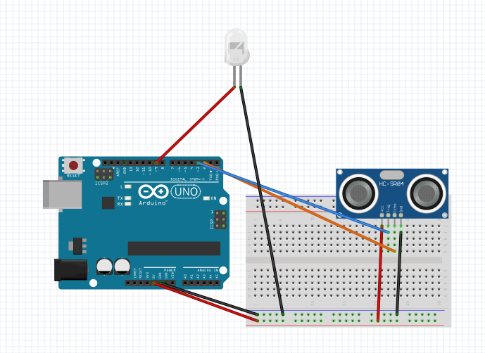

# Not-So-Basic-Arduino

## Hello Functions
#### Included Files:
<a href="Hello_Functions">Hello_Functions</a>  
In this assignment I learned how to use functions by writing a code to rotate a servo to a different angle depending on how close something is to the ultrasonic sensor. In it I used one function to return the distance and another to move the servo accordingly.  

 
One useful thing I learned from this was how using functions can make your life easier by allowing you to reuse code.

## NewPing()
#### Included Files:
<a href="NewPing()">NewPing()</a>  
For this assignment I used the NewPing library to get the distance instead of my own function. I made it so the distance was printed on the serial monitor in centimeters and an LED brightened or dimmed depending on far an obstruction was from the sensor.  

 
I had fun with this assignment because I made something where your physical action had an effect on the light.
